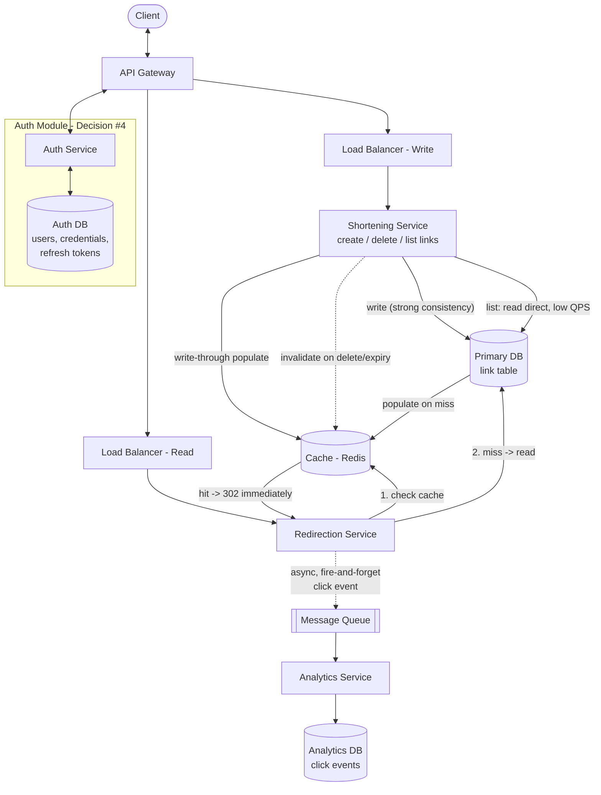

# High-Level Design — Component Diagram

## Write path (`shorten`, `delete`, `list`)

1. Client → API Gateway → Load Balancer (Write) → Shortening Service.
2. **Create:** Shortening Service writes to Primary DB first (source of truth, strong consistency — enforces the `(user_id, long_url)` idempotency check and alias-collision check from Decision #1/#2), then writes-through to Cache (Decision #11).
3. **Delete:** Shortening Service removes the row from Primary DB *and* actively invalidates the corresponding Cache entry (Decision #12) — otherwise a deleted link could keep resolving from stale cache until TTL expiry.
4. **List:** reads directly from Primary DB, bypassing Cache entirely — this is a low-QPS, per-user operation, not part of the hot path Cache exists to protect.

## Read path (`redirect`) — the ~650 QPS peak hot path

1. Client → API Gateway → Load Balancer (Read) → Redirection Service.
2. Redirection Service checks Cache first.
   - **Hit:** responds `302` immediately — no DB round trip.
   - **Miss:** reads Primary DB, populates Cache for next time, then responds `302`.
3. Independently of the above, Redirection Service fires an async, non-blocking click event toward the Message Queue. The redirect response is returned without waiting on this — satisfies FR #6 (analytics must not add synchronous latency to the redirect path).

## Analytics pipeline (decoupling — resolves the 20x storage finding)

Message Queue absorbs click events at whatever rate Redirection Service produces them, so a traffic spike on reads never directly backpressures the redirect path itself. Analytics Service consumes off the queue at its own pace and writes to a separate Analytics DB — physically and architecturally separate from Primary DB, per the ~500 GB vs. ~10 TB split found in capacity estimation. Raw-vs-aggregated storage strategy for Analytics DB is a decision for LLD, not here.

## Auth module

Routed through the API Gateway like every other request (no side-channel from Client). Kept as its own service with its own datastore (users, credentials, refresh tokens) to preserve the separable-module boundary from Decision #4 — this is a design assumption worth confirming: it implies Auth *could* be extracted into a fully independent deployable service later with minimal disruption, which is the whole point of the boundary.
